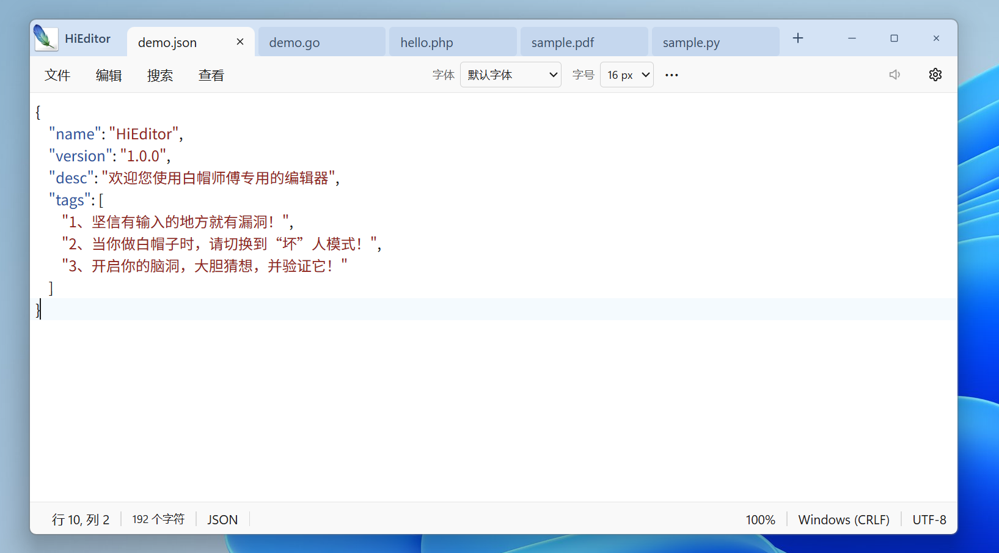
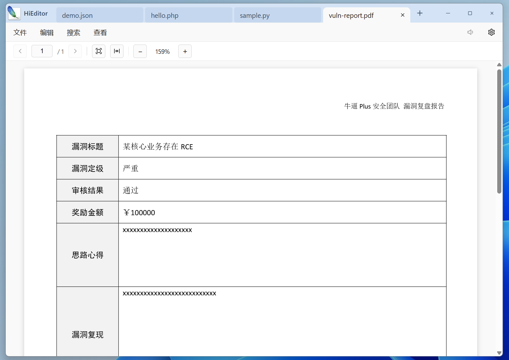
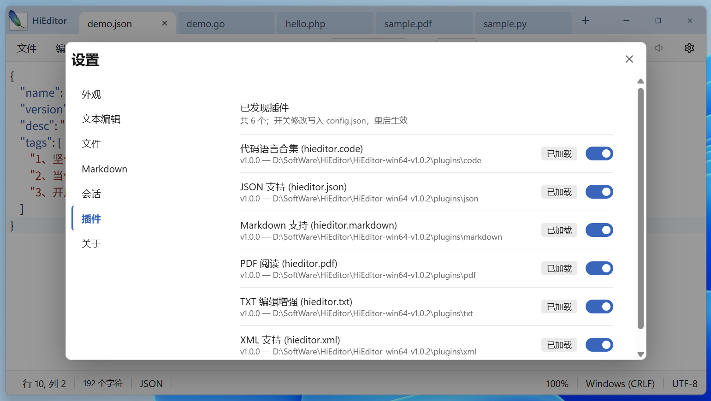

<div align="center">

# HiEditor

**一个轻量、快速、插件化的跨平台文本 / 代码编辑器**

简洁的 Windows 11 记事本风格界面，内置 16 门语言语法高亮、JSON/XML 格式化与 PDF 阅读，原生 C ABI 插件体系。

[]()
[]()
[]()
[]()

简体中文 | [English](README.en-US.md)

</div>

---

## 截图

**主界面 —— 多标签 / 语法高亮 / 按标签字体字号**



**PDF —— 阅读浏览**



**设置 —— 模态对话框 / 插件管理**



## ✨ 功能特性

### 编辑体验
- 🗂️ **多标签编辑**：独立编码 / 换行符 / 语言 / 缩放，会话自动恢复（崩溃、强杀后未保存内容不丢失）；标签可拖动排序，未保存内容在文件名前显示圆点标记，右键菜单支持打开所在文件夹 / 复制路径等
- 🔤 **按标签字体字号**：每个标签独立设置字体与字号（10–36px），行高按 1.5× 联动缩放，切回即恢复；`fonts/` 目录下的自定义字体自动进入字体下拉
- ↩️ **完整编辑菜单**：撤销 / 恢复 / 全选 / 剪切 / 复制 / 粘贴 / 删除，转大写 / 转小写 / 首字母大写其余小写
- 🔍 **查找 / 替换**：顶部面板，支持区分大小写 / 正则 / 全词匹配、循环查找、全部替换，界面语言本地化
- 🖱️ **拖放打开**、**打印**（Ctrl+P，支持输出为 PDF）、30%–500% 缩放、自动换行

### 语言与高亮
- **16 门语言语法高亮**：JSON / XML / Markdown / HTML / CSS / JavaScript / TypeScript / Python / Java / C# / C / C++ / Go / Rust / SQL / PHP / YAML / Shell / INI-TOML（按扩展名自动识别）
- **JSON / XML 格式化与压缩**：编辑菜单、右键菜单、快捷键（Ctrl+Shift+J / Ctrl+Alt+J / Ctrl+Shift+L / Ctrl+Alt+L）多入口
- **状态栏语言切换**：自动检测 / 纯文本置顶，选择高亮语言即时生效

### PDF 阅读
- 📕 **PDF 查看器**：打开 `.pdf` 文件即以只读标签页查看，基于 pdf.js 连续滚动渲染
- 🔢 **页码导航**：页码输入框回车跳转、上一页 / 下一页按钮（首页 / 末页自动置灰），滚动阅读时当前页码实时回显
- 🔍 **缩放与适应**：− / 百分比 / ＋（20%–500%），一键**适应页面** / **适应宽度**，Ctrl+滚轮、Ctrl+= / Ctrl+- / Ctrl+0 同样生效
- 📋 **文字选择复制**：内嵌文本层，可直接鼠标选中 PDF 中的文字并复制
- 阅读时自动隐藏字体 / 字号工具栏与状态栏，仅显示 PDF 专属工具栏

### 界面与主题
- 🎨 **浅色 / 深色主题**：深色模式编辑区 `#2B2B2B`，全部控件跟随主题
- 🌐 **界面国际化**：简体中文 / English，默认跟随系统，可强制指定
- 🧰 **智能工具栏**：默认仅字体 / 字号；插件可按语言声明自定义工具栏（如 Markdown 工具栏）；窗口宽度不足时自动收纳溢出工具项，`⋯` 按钮换行展开
- ⚙️ **模态设置对话框**：外观 / 文本编辑 / 文件 / Markdown / 会话 / 插件 / 关于
- 🪟 **窗口状态记忆**：可选记住上次关闭时的窗口大小与位置（设置开关）
- 📜 **长列表弹层**：高亮语言、最近文件等长列表限高滚动，打开时自动定位到当前选中项

### 系统集成（Windows）
- 🖱️ **资源管理器右键菜单**：设置中一键注册 / 注销“用 HiEditor 编辑”（当前用户级，无需管理员权限）
- 🪟 **单实例**：重复启动时文件自动转发到已运行实例的新标签页，支持多选文件一次打开
- 🎯 **桌面快捷方式**：设置中一键创建

### 文件与编码
- 📖 **多编码支持**：UTF-8（含 BOM）/ UTF-16 LE/BE / **GBK / GB18030** / ANSI 容错解码，按编码重新打开或保存
- ⚠️ **标签归属提示**：解码告警等状态横幅只在该标签显示，不干扰其它标签

### 插件化架构
- 🧩 **原生 C ABI 插件**：以动态库加载，`config.json` 声明式贡献语言 / 格式化命令 / 自定义工具栏 / 视图控件
- 📦 **7 个内置插件**：JSON、XML、Markdown、记事本（纯文本）、TXT 增强、代码语言合集、PDF 阅读
- 🔌 **插件管理**：设置页可视化启停，写入插件 `config.json`，重启生效

## 🚀 快速开始

### 下载使用
解压发行包后直接运行 `HiEditor.exe`（Windows 10/11 自带 WebView2 运行时，无需安装额外依赖）。

### 从源码构建

前置要求：[Rust](https://rustup.rs/)（MSVC 工具链）

```bash
# 按平台一键编译并打包发布 zip（版本号 / 排除插件 / 输出目录均可配置）
package-win-release.bat 1.0.0          # Windows（在 Windows 上执行）
./package-mac-release.sh 1.0.0         # macOS（在 macOS 上执行）
./package-linux-release.sh 1.0.0       # Linux（在 Linux/WSL 上执行）

# 或仅编译（主程序 + 全部插件）
cargo build --release
```

构建产物：`target/release/HiEditor.exe` + `plugins/<name>/bin/*.dll`；发布脚本会自动整理为解压即用的目录结构并压缩到 `dist/`。

**GitHub Actions 构建**：工作流为**仅手动触发**（Actions 页面 → Release Build → Run workflow），可选择单平台或全平台构建，产物 zip 上传至 Artifacts。工作流见 [.github/workflows/release.yml](.github/workflows/release.yml)。

## 🧩 插件开发

每个插件是一个目录：`config.json`（声明语言、格式化命令、工具栏等能力）+ 原生动态库（导出 `hi_plugin_meta / hi_plugin_command` 等稳定 C ABI 接口）。

```json
{
  "id": "hieditor.json",
  "languages": [{ "id": "json", "name": "JSON", "extensions": [".json", ".jsonc"], "highlight": true }],
  "formatters": [{ "id": "json.pretty", "label": "JSON 格式化", "language": "json", "command": "pretty" }]
}
```

完整的 ABI 协议、构建与部署说明见 **[插件开发指南.md](插件开发指南.md)**。

## 🗺️ 路线图

- [x] PDF 只读阅读（pdf.js 渲染 / 页码导航 / 缩放适应 / 文字复制）
- [x] Markdown 预览模式（Edit / Preview 分段切换，GFM 渲染）
- [ ] Markdown 所见即所得编辑（Milkdown，原地编辑）
- [ ] 转到行、书签
- [ ] GB 级大文件只读查看模式
- [ ] 多窗口支持

## 📄 文档

- [功能开发需求文档](docs/HiEditor-功能开发需求文档.md) —— 完整需求基线（UI 规格 / 功能编号 / 验收标准）
- [插件开发指南](插件开发指南.md) —— 从零开发一个 HiEditor 插件

---

<div align="center">

**HiEditor** —— 用 Rust 打造的顺手编辑器

</div>
